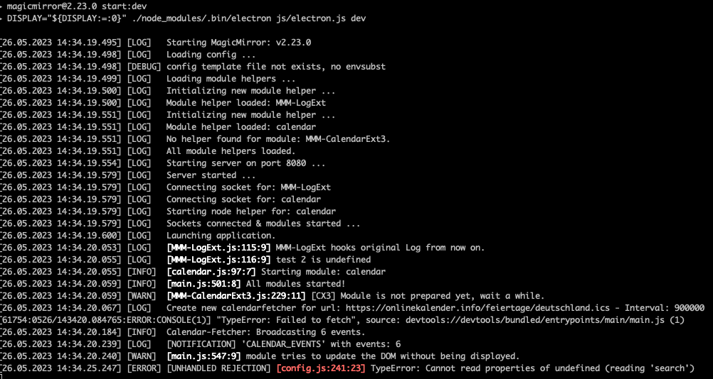

# MMM-LogExt

**MMM-LogExt** is a Log Extension module for [MagicMirror²](https://magicmirror.builders/) to help debugging and monitoring the system.



## Concept

Many beginners have a problem tracing an unexpected issue when he/she runs MagicMirror.
Usually, the start of debugging would be to examine `backend-log` and `frontend-log` but people may have confusing to use both how to.

I know there already exists `MMM-Logging` to help with this issue, but it seems not maintained anymore, and I need more features, so I have to re-invent a wheel by myself.

## Features

- To deliver frontend log (used by MM's `Log` Object) to backend log
- Customizable/Decorative Log messages
- To monitor Notifications
- `window.error` and `unhandledRejection` would be caught then transmit to the backend
- To be able to log external messages from other programs or devices via HTTP request

> [!IMPORTANT]
> This module deliver only `Log.xxx()` to the backend, not `console.xxx()`.

## Install

```sh
cd ~/MagicMirror/modules
git clone https://github.com/MMRIZE/MMM-LogExt
```

## Update

```sh
cd ~/MagicMirror/modules/MMM-LogExt
git pull
```

## Configuration

Put this module on top than other modules in config as far as possible.

```sh
    {
      module: "MMM-LogExt",
      config: {}
    },
```

This would be enough for most light users. You don't have to read furthermore. :D

Here are additional options to config

| **property**            | **default**       | **description**                                                            |
| ----------------------- | ----------------- | -------------------------------------------------------------------------- |
| **echo**                | `true`            | Whether to show log in front also. `false` will not show the log in front. |
| **notificationMonitor** | callback Function | See the `notification` part                                                |
| **beforeContext**       | callback Function | See the `decoration` part                                                  |
| **afterContext**        | callback Function | See the `decoration` part                                                  |
| **replaceJSON**         | callback Function | See the `replaceJSON` part                                                 |

## How to use

### decoration

You can pour some sugar on original contenxt with `beforeContext` and `afterContext` callback function:

- **`beforeContext({method, location, stack, context}) : String`**
- **`afterContext({method, location, stack, context}) : String`**

```js
beforeContext: function (msg) {
  return `[${msg.method}]`
}

afterContext: function (msg) {
  return `at (${msg.location})`
}

// Log.warn('hello')
// => [warn] hello at (xxxx.js:123:12)
```

- method : which member method function of `Log` called. (`log`, `warn`, `error`, ...)
- location : the location of `Log` called. (filename:lines:columns)
- stack : If availabe, the caller stack array
- context : arguments of the `Log` call. (You don't need to include context in these function, because context itself will be inserted between these two return values automatically)

If you don't need any decoration, just return `''` or `beforeContext: false` (or any value not function)

### Notification

You can monitor notification with this callback function:

**`notificationMonitor(notification, payload, senderName) : String`**

```js
notificationMonitor: (notification, payload, senderName) => {
  if (senderName === "calendar")
    return `'${notification}' with events: ${payload.length}`;
  return "";
};

// => 'CALENDAR_EVENTS' with events: 10
```

Usually there would be too many notifications, so, you'd better to filter out specific notifications with `notification`, `payload`, `senderName` conditions to get proper target notification only.

### replaceJSON (for expert)

Logging is usually not regarded for inspection/watch the complex data value. This module generally deliver simplified data to backend log through `JSON.stringify()` So, `Function`, `Symbol` or `undefined` will not be transmitted to the backend. (It would be converted to `null` or equivalents.), and some complex-nested object might be also.

When you need more detailed information of those kinhds of values, you can use `replacer` of `JSON.stringify` to extend the features.

**`replaceJSON(key, value) : Any`**

```js
replaceJSON: (key, value) => {
  if (typeof value === "undefined") return `${key} is undefined`;
  return value;
};
// Log.log('hello', this.config?.foo)
// => hello 2 is undefined
// 'key' would be index of array or key of object or something. In this example, `this.config?.foo` is 2nd argument of log calling.
```

Ref. https://developer.mozilla.org/en-US/docs/Web/JavaScript/Reference/Global_Objects/JSON/stringify

### Log through HTTP POST

When you need to aggregate some Log from external program or device, it could be done with simple POST request.

```sh
curl -d '{"method":"info", "context":"HomeAssistant is activated."}' -H "Content-Type: application/json" -X POST http://localhost:8080/logext

# => HomeAssitant is activated.
```

## History

### **1.0.0 (2022-05-26)**

- Released

## Author

- Seongnoh Yi (eouia0819@gmail.com)
  [](https://ko-fi.com/Y8Y56IFLK)

## License

This project is licensed under the MIT License - see the [LICENSE](LICENSE.md) file for details.
